# 💳 SmartSpend AI

**SmartSpend AI** is a full-stack financial forecasting dashboard that uses Machine Learning to predict future spending habits based on transaction history. It features a modern, responsive UI with Dark Mode, interactive data visualizations, and a microservices architecture.

---

## 📸 Project Screenshots

### 1. The Dashboard (Dark Mode)


> *Real-time financial tracking with AI-powered trend forecasting.*

### 2. Transaction Management (Modal)


> *Clean, glassmorphism-styled forms for managing expenses.*

### 3. Data Visualization (Light Mode)


> *Dynamic charts showing spending breakdown by category.*

---

## 🚀 Tech Stack

**Frontend (Client):**
* **React.js** (Hooks, State Management)
* **Chart.js** (Data Visualization)
* **CSS Variables** (Theming & Dark Mode)
* **Axios** (API Communication)

**API Gateway (Server):**
* **Node.js & Express** (REST API)
* **Microservices Pattern** (Routes traffic to AI Service)
* **File System (fs)** (JSON Data Persistence)

**AI Engine (ML Service):**
* **Python & Flask** (Inference Server)
* **Scikit-Learn** (Linear Regression Model)
* **Pandas & NumPy** (Data Processing)

---

## 🏗️ System Architecture

The application follows a decoupled **Microservices Architecture**. The React frontend never talks to the Python AI directly; all traffic is secured and managed by the Node.js API Gateway.

```mermaid
graph TD;
    User[👤 User] -->|Interacts| Client[⚛️ React Frontend];
    Client -->|HTTP GET/POST| Gateway[🟢 Node.js API Gateway];
    Gateway -->|Read/Write| DB[(📂 JSON Database)];
    Gateway -->|Forward Data| AI[🐍 Python AI Service];
    AI -->|Linear Regression| Model[🧠 ML Model];
    Model -->|Return Prediction| AI;
    AI -->|Return JSON| Gateway;
    Gateway -->|Return JSON| Client;
```



---

## ✨ Key Features

* **🤖 AI Forecasting:** Uses Linear Regression to predict next month's spending based on historical data.
* **🌗 Dark Mode:** Fully responsive theme toggling using CSS variables.
* **📊 Interactive Charts:**
    * **Line Chart:** Visualizes spending trends and future AI predictions.
    * **Doughnut Chart:** Breaks down expenses by category (Food, Rent, Tech, etc.).
* **📝 CRUD Operations:** Users can Create, Read, and Delete transactions with a persistent JSON database.
* **💎 Modern UI:** Features glassmorphism modals, clean typography, and professional icons.
* **📈 Smart Insights:** Automatically calculates month-over-month growth and top spending categories.

---

## 🔧 How to Run Locally

### Prerequisites
* Node.js & npm
* Python 3 & pip

### 1. Clone the Repository
```bash
git clone [https://github.com/YOUR_USERNAME/smart-spend-ai.git](https://github.com/YOUR_USERNAME/smart-spend-ai.git)
cd smart-spend-ai
```
### 2. Start the AI Service (Python)
```bash
cd ml-service
pip3 install flask flask-cors pandas scikit-learn
python3 app.py
# 🧠 AI Service running on Port 5001
```
### 3. Start the API Gateway (Node.js)
Open a new terminal:
```bash
cd server
npm install
node index.js
# 🚀 Gateway running on Port 8000
```
### 4. Start the Frontend (React)
Open a new terminal:
```bash
cd client
npm install
npm start
# ⚛️ App opens at http://localhost:3000
```
---

## 📡 API Endpoints

The Node.js Gateway exposes the following endpoints:

| Method | Endpoint | Description |
| :--- | :--- | :--- |
| `GET` | `/api/spending` | Retrieve all transactions (Sorted by Date). |
| `POST` | `/api/spending` | Add a new transaction (Auto-generates ID). |
| `DELETE` | `/api/spending/:id` | Remove a transaction by ID. |
| `POST` | `/api/forecast` | Sends history to Python AI and returns prediction. |

---

## 💡 What I Learned
* Implementing **Microservices** to separate concerns between backend logic and AI computation.
* Building a custom **CSS Theme Engine** for switching between Light and Dark modes.
* Handling **Asynchronous Data Flow** across three different technology stacks (React -> Node -> Python).
* Visualizing complex datasets using **Chart.js**.

---

*Built by Josh Lee*
